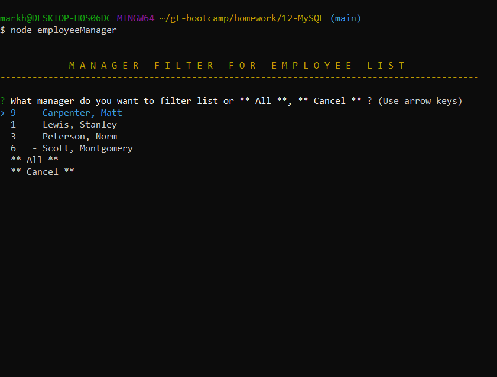

# 12-MySQL
# Homework - Employee Tracker


## Description 📰
```md
This application (Employee Manager) provides a command line interface for a user to maintain employee related data.  The user can make selections from two menus: Maintenance Menu and Reports Menu. The Maintenance Menu provides options that allow the user to maintain employee related data. The Reports menu provides options that allow the user to list employee relateed data in tabular format.

TECHNICAL DEATAILS
The user can Create/Read/Update/Delete data in all three employee related tables (Department, Employee, Role). All fields (columns) with the exception of the record id (column: id) can be modified in each table.  Data integrity is enforced, so a user cannot delete a department record if it is used on a role record.  A role record cannot be deleted if it is used on an employee record.

I altered the work flow because the example did not follow real world best practices and had an amateur appearance.
```

## Table of Contents 📚
- [Installation](#installation)
- [Usage](#usage)
- [Credits](#credits)
- [License](#license)
- [Badges](#badges)
- [Questions](#questions)
- [Tests](#tests)

## Installation 🚧
```md
The following steps should be used to install:
1. Download Repository from GitHub
2. Install NPM installer (if not already installed)
3. Install dependencies by using command: NPM i
4. You will need to create a .env file off of the root directory with the following:
    1. DB_HOST=localhost
    2. DB_USER=<your MySQL id>
    3. DB_PASSWORD=<your MySQL password>
    4. DB_DATABASE=employeesDB
    5. DB_PORT=3306
5. From the MySQL CLI or GUI such as MySQL Workbench run the ./sql/employeesSchema.sql and the ./sql/employeesSeeds.sql scripts
```

## Usage 🧮
node employeeManager.js





## Credits 👷
```md
Mark Harrison   
```

## License 📜
```md
ISC license
```

## Badges 🛡️
```md


```

## Questions 🔍
```md
:octocat: Follow me on GitHub: [MarkHatTHORinc](https://github.com/MarkHatTHORinc)
✉️ Contact me: markh@thorinc.com
```

## Tests  💻
```md
1. Download GitHub Repostory
2. Run the Application (node employeeManager.js)
3. Verify you are able to Add / Delete / Modify for each table via the Maintenance Menu.
    1. Verify you can update the manager on an employee (bonus)
    2. Verify you are able to delete records (bonus)
    3. Verify you can't delete a record with dependencies (bonus - bonus)
4. Verify you are able to all data via the Reports Menu.
    1. Verify you can view employees by manager selection (bonus)
    2. Verify department list shows utilized budget (bonus)
```

Created by [Generator](_https://github.com/MarkHatTHORinc/09-NodeJS_) using _professional_ template. 